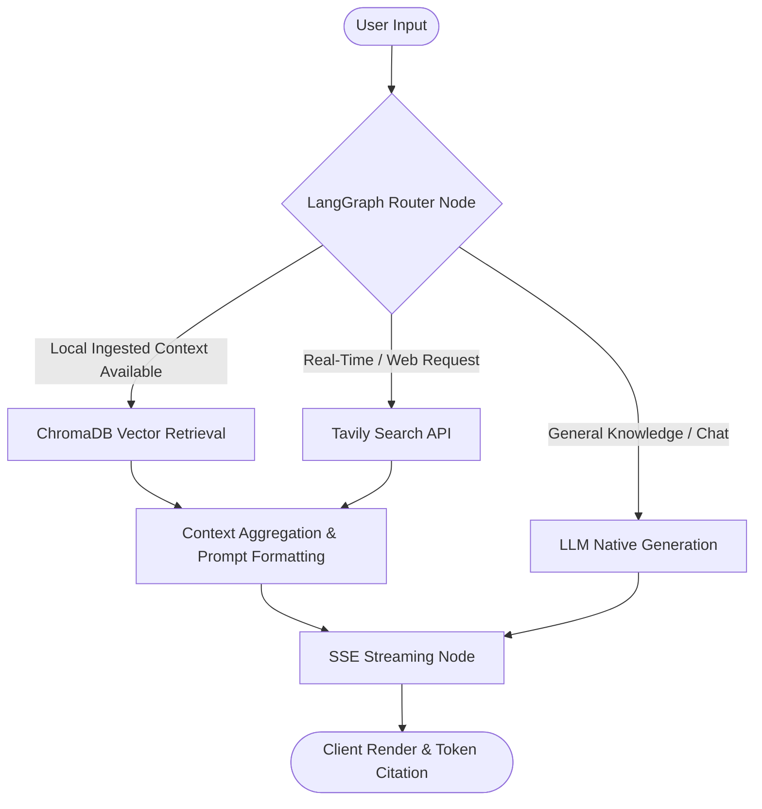
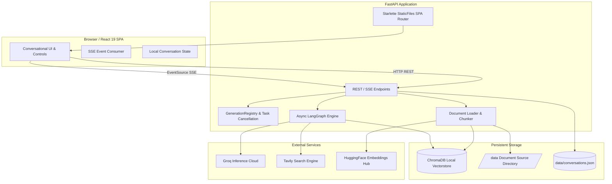

# Knowra - Multi-Source RAG Chatbot with Dynamic Retrieval

[](TODO_LIVE_URL)
[](https://fastapi.tiangolo.com/)
[](https://react.dev/)
[](https://tailwindcss.com/)
[](https://github.com/langchain-ai/langgraph)
[](https://www.trychroma.com/)

Knowra is a high-performance, open-source Retrieval-Augmented Generation (RAG) conversational agent engineered for intelligent, multi-source knowledge retrieval. Featuring a modern React 19 Single Page Application (SPA) served directly by an asynchronous FastAPI backend, Knowra intelligently orchestrates between native LLM conversational logic, local ChromaDB vector semantic retrieval with Maximum Marginal Relevance (MMR), and live web search via Tavily.

---

## Table of Contents

1. [Overview & Problem Statement](#1-overview--problem-statement)
2. [Key Highlights & Architectural Features](#2-key-highlights--architectural-features)
3. [Dynamic Retrieval Decision Matrix & Workflow](#3-dynamic-retrieval-decision-matrix--workflow)
4. [Tech Stack & Library Choices](#4-tech-stack--library-choices)
5. [System Architecture & Data Flow](#5-system-architecture--data-flow)
6. [Retrieval Modes Deep Dive](#6-retrieval-modes-deep-dive)
7. [Real-time Streaming & Socket-Level Cancellation](#7-real-time-streaming--socket-level-cancellation)
8. [Document Ingestion, Chunking & Embeddings Pipeline](#8-document-ingestion-chunking--embeddings-pipeline)
9. [Evaluation Framework & Benchmarking](#9-evaluation-framework--benchmarking)
10. [Local Setup & Quick Start Guide](#10-local-setup--quick-start-guide)
11. [Docker & Containerized Deployment](#11-docker--containerized-deployment)
12. [Environment Configuration](#12-environment-configuration)
13. [API Endpoints Reference](#13-api-endpoints-reference)
14. [Frontend UI/UX Architecture](#14-frontend-uiux-architecture)
15. [Conversation Persistence & Thread Lifecycle](#15-conversation-persistence--thread-lifecycle)
16. [Vector Store Administration](#16-vector-store-administration)
17. [Testing & Quality Assurance](#17-testing--quality-assurance)
18. [Project Structure](#18-project-structure)
19. [Troubleshooting & Common Pitfalls](#19-troubleshooting--common-pitfalls)
20. [Production Deployment Strategies](#20-production-deployment-strategies)
21. [Limitations & Explicit Non-Goals](#21-limitations--explicit-non-goals)
22. [Security & Responsible Disclosure](#22-security--responsible-disclosure)
23. [License & Acknowledgements](#23-license--acknowledgements)

---

## 1. Overview & Problem Statement

Traditional RAG architectures suffer from rigid retrieval paths: every user query triggers expensive vector searches or web lookups, even for conversational pleasantries, simple reasoning, or domain-specific questions outside local knowledge boundaries.

**Knowra** solves this using an asynchronous LangGraph decision graph that dynamically evaluates query intent, semantic context, and local index availability. By determining the optimal retrieval strategy per turn, Knowra minimizes latency, reduces API costs, eliminates hallucinations, and provides verifiable citations.

---

## 2. Key Highlights & Architectural Features

- **Dynamic Multi-Source Routing:** Autonomous routing between Native LLM reasoning, ChromaDB vector retrieval, and Tavily live search.
- **Server-Sent Events (SSE) Streaming:** Sub-100ms time-to-first-token streaming via FastAPI and `EventSourceResponse`.
- **Socket-Level Generation Cancellation:** Immediate cancellation of in-flight LLM requests via `asyncio.Task` and HTTP connection aborts, preventing wasted API quota.
- **Pre-Compiled SPA Distribution:** FastAPI directly mounts and serves the pre-built React 19 SPA, enabling zero-Node.js python-only execution for users.
- **Thread Persistence & Auto-Summarization:** Multi-conversation storage with background LLM topic title generation.
- **Vector Index Lifecycle Management:** Real-time document ingestion, status tracking, vectorstore rebuilding, and cache invalidation.
- **Built-In Benchmarking Suite:** Automated RAG evaluation measuring retrieval latency, faithfulness, and answer relevance.

---

## 3. Dynamic Retrieval Decision Matrix & Workflow

Knowra leverages LangGraph conditional edges to route user queries dynamically:



| User Intent / Mode | Target Source | Fallback / Condition | Badge Displayed |
| :--- | :--- | :--- | :--- |
| Conversational / Logic | **LLM Native** | Direct generation | `LLM Native` |
| Local Document Query | **Vectorstore** | ChromaDB with MMR (`k=4`, `lambda=0.25`) | `Vectorstore` |
| Real-Time / Current Events | **Web Search** | Tavily Search API | `Web Search` |
| Manual Mode Override | **Forced Route** | User-selected mode in UI Control Bar | Respective Badge |

---

## 4. Tech Stack & Library Choices

### Backend
- **Framework:** FastAPI / Starlette (Asynchronous ASGI server)
- **RAG & Orchestration:** LangChain, LangGraph, LangChain-Groq, LangChain-Community
- **Vector Database:** ChromaDB (Embedded local persistent vector store)
- **Embeddings:** HuggingFace `sentence-transformers/all-MiniLM-L6-v2` (Local CPU execution)
- **Search Provider:** Tavily AI Search API
- **Inference Models:** Groq (Llama-3.3-70b-Versatile, Llama-3.1-8b-Instant, Mixtral-8x7b-32768)

### Frontend
- **Framework:** React 19 (TypeScript)
- **Build Tool:** Vite 8
- **Styling:** Tailwind CSS v4
- **Icons:** Lucide React
- **Markdown & Code:** React Markdown, Remark GFM, PrismJS

---

## 5. System Architecture & Data Flow



---

## 6. Retrieval Modes Deep Dive

1. **LLM Native:**
   Used for greetings, conversational chit-chat, code generation, and logical reasoning queries. Bypasses document retrieval entirely to save compute and deliver rapid responses.
2. **Vectorstore Retrieval (ChromaDB):**
   Executes Maximum Marginal Relevance (MMR) search across chunked local PDF and TXT documents. Returns top `k=4` chunks with diversity parameter `lambda_mult=0.25`, ensuring high semantic relevance while avoiding redundant chunk overlap.
3. **Web Search (Tavily):**
   Triggers live web searches for queries requiring real-time information, breaking news, or domain knowledge not present in the local vectorstore. Formats web search snippets into structured context blocks with source URLs.

---

## 7. Real-time Streaming & Socket-Level Cancellation

Knowra implements true server-side token streaming using `EventSourceResponse` over HTTP Server-Sent Events.

### Socket-Level Abort Architecture
- When a user clicks **Stop** or initiates a new query while generation is in progress, the frontend immediately aborts the browser `EventSource` connection and issues a `POST /api/chat/cancel` request with the associated `thread_id`.
- The backend `GenerationRegistry` tracks active `asyncio.Task` references per thread.
- Upon receiving a cancel signal, the server task is cancelled, immediately unwinding the upstream HTTP connection to Groq and releasing GPU/network resources. Partial tokens generated prior to cancellation are safely committed to the conversation history.

---

## 8. Document Ingestion, Chunking & Embeddings Pipeline

1. **Document Loading:** Ingests `.pdf` and `.txt` files from the [data/](data/) directory using `PyPDFLoader` and `TextLoader`.
2. **Recursive Text Chunking:** Chunks text into 1,000-character segments with a 200-character overlap using `RecursiveCharacterTextSplitter`.
3. **Embedding Generation:** Converts chunks into 384-dimensional dense vector embeddings using `all-MiniLM-L6-v2` via HuggingFace on CPU.
4. **Vector Persistence & Caching:** Persists vector embeddings into [chroma_db/](chroma_db/) and caches the Chroma client in-memory with thread-safe invalidation routines (`clear_cached_chroma()`).

---

## 9. Evaluation Framework & Benchmarking

Knowra includes a built-in evaluation engine to assess RAG pipeline health:
- **Test Datasets:** Standardized queries evaluating accuracy across Native, Vectorstore, and Web retrieval paths.
- **Metrics Evaluated:** Retrieval Latency (ms), Time to First Token (TTFT), Answer Faithfulness, and Source Relevance.
- **Execution:** Triggerable via the frontend Admin Modal or programmatically through `POST /api/evaluation/run`.

---

## 10. Local Setup & Quick Start Guide

### Prerequisites
- Python 3.10, 3.11, or 3.12
- Active [Groq API Key](https://console.groq.com/)
- Optional: [Tavily API Key](https://tavily.com/) for live web search

### Quick Start (Python Only - Zero Node.js Required)

Knowra includes pre-compiled frontend assets in `frontend/dist/`. You can run the entire application using Python:

```bash
# 1. Clone repository
git clone https://github.com/faaizhamid07/Multi-Source-RAG-Chatbot-with-Dynamic-Retrieval-.git
cd Multi-Source-RAG-Chatbot

# 2. Set up virtual environment
python -m venv .venv
source .venv/bin/activate  # On Windows: .venv\Scripts\activate

# 3. Install dependencies
pip install -r requirements.txt

# 4. Configure environment variables
cp .env.example .env
# Open .env and insert your GROQ_API_KEY and TAVILY_API_KEY

# 5. Launch the application
./run.sh
# Or manually: uvicorn src.api.main:app --host 0.0.0.0 --port 8000
```
Open **`http://localhost:8000`** in your browser.

---

## 11. Docker & Containerized Deployment

Knowra provides complete Docker and Docker Compose definitions for production deployment.

```bash
# Build and start container
docker-compose up --build -d

# View real-time container logs
docker-compose logs -f

# Stop container
docker-compose down
```

The containerized service runs on port `8000` with automated health checks configured against `/api/health`.

---

## 12. Environment Configuration

Create a `.env` file in the root directory based on `.env.example`:

| Variable | Required | Description | Default |
| :--- | :--- | :--- | :--- |
| `GROQ_API_KEY` | **Yes** | Groq Cloud API authentication key | *None* |
| `TAVILY_API_KEY` | Optional | Tavily Web Search API key | *None* |
| `MODEL_NAME` | No | Primary LLM model identifier | `llama-3.3-70b-versatile` |
| `TEMPERATURE` | No | Model generation temperature | `0.0` |
| `EMBEDDING_MODEL_NAME` | No | HuggingFace sentence transformer model | `all-MiniLM-L6-v2` |
| `DATA_PATH` | No | Local directory for raw documents | `data/` |
| `CHROMA_PATH` | No | Local directory for persistent ChromaDB | `chroma_db/` |

---

## 13. API Endpoints Reference

### Core & Streaming
- `GET /api/health` — Application status and uptime check.
- `GET /api/status` — API key validation status (returns boolean flags, never raw keys).
- `POST /api/chat` — Server-Sent Events (SSE) streaming chat endpoint.
- `POST /api/chat/cancel` — Cancels active generation task for a specific `thread_id`.

### Conversation Management
- `GET /api/conversations` — Retrieves all stored conversation summaries.
- `GET /api/conversations/{id}` — Retrieves full message history for a specific conversation.
- `POST /api/conversations` — Creates a new conversation thread.
- `DELETE /api/conversations/{id}` — Deletes a conversation thread.

### Document & Vectorstore Operations
- `GET /api/documents` — Lists ingested documents and total vector count.
- `POST /api/documents/upload` — Uploads PDF/TXT documents to the data directory.
- `POST /api/vectorstore/rebuild` — Re-chunks data documents and rebuilds ChromaDB index.
- `POST /api/vectorstore/purge` — Wipes ChromaDB vector index.

---

## 14. Frontend UI/UX Architecture

- **Control Bar:** Dynamic model selection, retrieval mode manual override, and real-time backend health indicator.
- **Streaming Message Bubbles:** Markdown formatting, real-time code syntax highlighting, and dynamic route badges (`LLM Native`, `Vectorstore`, `Web Search`).
- **Sidebar & Thread Drawer:** Thread creation, one-click thread switching, and deletion.
- **Admin Modal:** Tabbed interface for document upload, index rebuilding, and evaluation runs.
- **Dark/Light Theme:** Persistent color scheme toggling with Tailwind CSS v4 CSS variables.

---

## 15. Conversation Persistence & Thread Lifecycle

- Conversations are serialized to `data/conversations.json` on disk.
- When a user sends the first prompt in a new conversation, a background asynchronous task (`schedule_title_generation`) invokes a compact LLM prompt to generate a 3-5 word thread title without blocking message streaming.
- Thread switching preserves all past messages, retrieval badges, and timestamps.

---

## 16. Vector Store Administration

- **Indexing:** Supports PDF and TXT document ingestion.
- **Rebuilding:** `POST /api/vectorstore/rebuild` clears in-memory Chroma caches, re-reads all files in `data/`, creates new chunks, and re-indexes all embeddings.
- **Cache Eviction:** Thread-safe `clear_cached_chroma()` invalidates the cached vectorstore client across active worker threads.

---

## 17. Testing & Quality Assurance

Knowra maintains a multi-tier test suite covering unit tests, ASGI integration tests, and Playwright end-to-end browser automation:

```bash
# Run backend unit and integration tests
python -m unittest discover -s tests -p "test_*.py"

# Run full end-to-end Playwright browser test suite
python tests/test_e2e_all_workflows.py
```

### Test Suites Included:
1. `test_phase3a_cancellation.py`: Socket-level stream cancellation, task registry teardown, and partial response preservation.
2. `test_phase3b_e2e_integration.py`: ASGI integration testing of SSE streaming, document management, and conversation CRUD.
3. `test_e2e_all_workflows.py`: Playwright browser automation verifying all 7 core user workflows across UI components.

---

## 18. Project Structure

```
Multi-Source-RAG-Chatbot/
├── .env.example                # Environment variable configuration template
├── .gitignore                  # Git ignore rules for secrets, DBs, and logs
├── Dockerfile                  # Production container definition
├── docker-compose.yml          # Container orchestration configuration
├── requirements.txt            # Python dependencies
├── run.sh                      # Unified management script (dev, test, build)
├── README.md                   # Complete project documentation
├── data/                       # Document storage directory (.pdf, .txt)
├── chroma_db/                  # Chroma vector database storage
├── frontend/                   # React 19 + TypeScript frontend application
│   ├── src/                    # Frontend source code (Components, Hooks, API)
│   ├── dist/                   # Pre-compiled production frontend assets
│   ├── package.json            # Node.js dependencies
│   ├── vite.config.ts          # Vite build & proxy configuration
│   └── README.md               # Frontend developer guide
├── src/                        # Python backend application
│   ├── api/                    # FastAPI endpoints & server entrypoint
│   │   └── main.py             # Main API routing, SSE streaming, static mount
│   ├── chatbot_graph.py        # LangGraph decision routing graph
│   ├── chatbot_graph_async.py  # Asynchronous LangGraph execution engine
│   ├── config.py               # Centralized configuration & environment loader
│   ├── data_loader.py          # Document loader, text splitter, vector store manager
│   ├── tools.py                # External tool definitions (Tavily search)
│   └── utils/                  # Core backend helper utilities
│       ├── env_utils.py        # Environment inspection and status checks
│       └── file_utils.py       # Thread-safe file & conversation I/O
└── tests/                      # Automated test suites
    ├── test_phase3a_cancellation.py
    ├── test_phase3b_e2e_integration.py
    └── test_e2e_all_workflows.py
```

---

## 19. Troubleshooting & Common Pitfalls

- **ChromaDB / SQLite Errors on Windows:** Ensure Python 3.10-3.12 is used. ChromaDB includes embedded SQLite compatible with standard Python distributions.
- **Groq Rate Limits (429):** Reduce concurrency or switch to `llama-3.1-8b-instant` in the UI control bar for higher token-per-minute limits.
- **Port 8000 Already in Use:** Specify an alternate port when running uvicorn: `uvicorn src.api.main:app --port 8080`.
- **SSE Stream Interrupted:** Check if an aggressive browser ad-blocker or proxy is buffering chunked HTTP responses.

---

## 20. Production Deployment Strategies

### Direct Linux / VPS Deployment
Use Systemd to manage the Uvicorn service behind an Nginx reverse proxy with SSE buffering disabled:
```nginx
location /api/chat {
    proxy_pass http://127.0.0.1:8000;
    proxy_set_header Connection '';
    proxy_http_version 1.1;
    chunked_transfer_encoding off;
    proxy_buffering off;
    proxy_cache off;
}
```

### Cloud Container Deployment (AWS ECS / GCP Cloud Run / Render)
Deploy using the included `Dockerfile`. Set `GROQ_API_KEY` and `TAVILY_API_KEY` in your cloud platform's secret manager.

---

## 21. Limitations & Explicit Non-Goals

- **Authentication:** Knowra is designed as a single-tenant workspace. User accounts and multi-tenant authentication are non-goals for this release.
- **Cloud Vector DBs:** Knowra utilizes embedded local ChromaDB for zero-dependency local execution; managed cloud vector stores (Pinecone/Weaviate) are not required.
- **Distributed Multi-Node Scale:** Designed for lightweight, single-instance containerized deployment.

---

## 22. Security & Responsible Disclosure

- **Zero Secret Exposure:** Backend API endpoints (`/api/status`) expose only boolean validation flags, never returning API keys to the browser.
- **Local Embedding Processing:** HuggingFace sentence transformer models execute 100% locally on CPU; document chunks are never transmitted to third parties for embedding generation.

---

## 23. License & Acknowledgements

This project is licensed under the [MIT License](LICENSE).

### Acknowledgements
- [LangChain & LangGraph](https://github.com/langchain-ai) for agent orchestration.
- [FastAPI](https://fastapi.tiangolo.com/) for high-speed asynchronous API serving.
- [Groq](https://groq.com/) for LPU-accelerated low-latency LLM inference.
- [ChromaDB](https://www.trychroma.com/) for embedded vector search.
- [Tavily AI](https://tavily.com/) for search engine retrieval.
