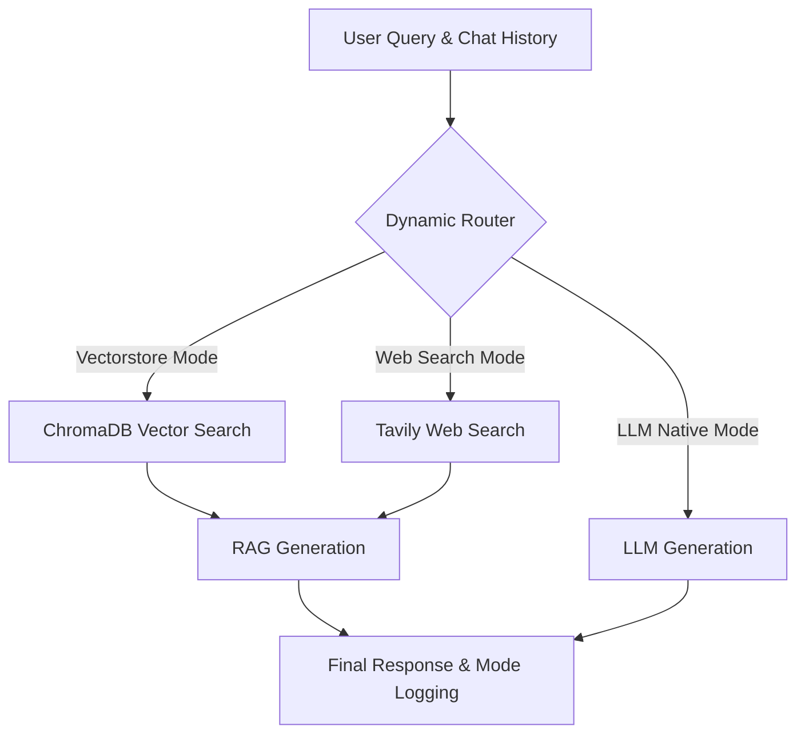

# Multi-Source RAG Chatbot with Dynamic Retrieval

An intelligent **Retrieval-Augmented Generation (RAG)** chatbot built for evaluating dynamic routing between local data, real-time web search, and internal LLM knowledge.

This repository represents an independently maintained and substantially extended M.Tech project based on an open-source foundation, specifically focused on enhancing stability, UI/UX, and performance.

## Overview

Modern Retrieval-Augmented Generation (RAG) applications must gracefully handle questions that their local documents cannot answer. This application actively decides the best retrieval path for every user query. It uses a LangGraph-based state machine to route queries dynamically:
- Searching a local vector database for document-grounded answers.
- Searching the public web for real-time information.
- Responding natively from the LLM for general conversational queries.

## Key Features

- **Dynamic Routing:** A built-in LLM classification node determines whether to use Vectorstore, Web Search, or LLM-Native mode.
- **Multi-Source Question Answering:** Combines local PDF/TXT documents, Tavily web search, and Groq LLM capabilities.
- **Conversation History:** Maintains multi-turn chat memory directly inside the Streamlit session with a collapsible sidebar for managing past conversations.
- **Chat & Evaluation Modes:** Offers a standard chat interface alongside a dedicated evaluation dashboard.
- **Light/Dark UI Support:** Native theme integration specifically tailored for readability and contrast in both modes.
- **Progressive Response Rendering:** Fast, chunk-based streaming of answers that eliminates artificial display delays while retaining a typewriter aesthetic.
- **Cached Resources:** Utilizes Streamlit's resource caching to persist ChromaDB instances and HuggingFace models in memory, resulting in near-instant consecutive query times.
- **Response Auto-Scroll:** Includes customized JavaScript observers to ensure the latest messages automatically stay in view.

## System Architecture

The core logic uses a state graph (LangGraph) to evaluate and route requests.



## Retrieval Modes

### Vectorstore / RAG
Extracts chunks from locally ingested PDFs and text files stored in ChromaDB using a HuggingFace embedding model (`sentence-transformers`). Employs Maximal Marginal Relevance (MMR) for diverse retrieval.

### Web Search
Fetches live web snippets through the Tavily API to answer questions outside the local document scope or requiring current events.

### LLM Native
By-passes external retrieval entirely. Used for greetings, general knowledge, or conversational continuity where searching would add unnecessary latency.

## User Interface

- **Chat Interface:** Primary interaction environment showing categorized dynamic responses with mode captions (e.g., 🌐 Web Search).
- **Mode Selection:** Toggle easily between Chat Mode and Evaluation Mode.
- **Conversation Sidebar:** Allows switching between, storing, and deleting past conversations within the active session.
- **Theme Support:** Streamlit-native adaptable aesthetics including specific CSS mappings for chat bubbles, buttons, and badges.
- **Evaluation Interface:** Run automated tests against predetermined question data and view real-time accuracy and performance benchmarks.

## Evaluation

The included Evaluation Mode executes a benchmark suite against a predefined CSV dataset (`tests/benchmark_questions.csv`). 

Currently, this evaluation focuses primarily on system validation:
- **Routing Accuracy:** Measures if the dynamic router correctly selected the intended mode for the question.
- **Latency Tracking:** Logs the duration of the entire graph execution.
- **Error Handling:** Identifies configuration or API timeouts during batch executions.
- **Stop Controls:** Gracefully halt evaluation midway without crashing the application.

## Technology Stack

- **Python 3.12**
- **Streamlit:** Frontend UI and application state management.
- **LangChain & LangGraph:** State graph execution and RAG orchestration.
- **ChromaDB:** Local, embedded vector database.
- **HuggingFace Sentence Transformers:** Local document embedding models.
- **Groq API:** Ultra-fast LLM inference engine.
- **Tavily API:** Real-time web search capabilities.

## Project Structure

```
Multi-Source-RAG-Chatbot/
├── data/                  # Source documents (PDFs/TXT) for ingestion
├── src/                   # Main application code
│   ├── app.py             # Streamlit frontend & application loop
│   ├── chatbot_graph.py   # LangGraph state machine & routing logic
│   ├── config.py          # Environment & system configurations
│   ├── data_loader.py     # Document loaders, embedding caching, & ChromaDB
│   ├── tools.py           # External integrations (Tavily)
│   └── utils/             # Helper utilities (CSS, JS hooks, Chat rendering)
├── tests/                 # Benchmark datasets & legacy test scripts
├── .env                   # Environment variables (Do Not Track)
└── requirements.txt       # Python dependencies
```

## Installation

**1. Clone the repository:**
```bash
git clone https://github.com/faaizhamid07/Multi-Source-RAG-Chatbot-with-Dynamic-Retrieval-.git
cd Multi-Source-RAG-Chatbot-with-Dynamic-Retrieval-
```

**2. Create a virtual environment:**
```bash
python -m venv .venv
# On Windows:
.venv\Scripts\activate
# On macOS/Linux:
source .venv/bin/activate
```

**3. Install dependencies:**
```bash
pip install -r requirements.txt
```

**4. Prepare Environment Variables:**
Create a `.env` file in the root directory and add your API keys (see below).

**5. Add Documents (Optional):**
Place PDFs or TXT files inside the `data/` directory.

## Environment Variables

Include the following in your `.env` file. Do not commit this file to version control.

```env
# Required
GROQ_API_KEY="gsk_..."
TAVILY_API_KEY="tvly-..."

# Optional Model Configuration (defaults exist in code)
GROQ_MODEL_NAME="meta-llama/llama-4-maverick-17b-128e-instruct"
EMBEDDING_MODEL_NAME="sentence-transformers/all-MiniLM-L6-v2"

# Optional LangSmith Tracing
LANGCHAIN_API_KEY="ls__..."
LANGCHAIN_TRACING_V2="true"
LANGCHAIN_ENDPOINT="https://api.smith.langchain.com"
LANGCHAIN_PROJECT="multi-source-rag-chatbot"
```

## Running the Application

Start the Streamlit application natively:

```bash
streamlit run src/app.py
```
*If necessary, run `PYTHONPATH=src streamlit run src/app.py` in environments having module resolution issues.*

## Development Notes

- **Cached Embeddings/Vectorstore:** To combat long UI freezing times from repeated initialization, HuggingFace embeddings and the ChromaDB instances are pinned into `@st.cache_resource`. Changes or deletion of the vectorstore gracefully clear these caches without requiring application restarts.
- **Session-Based Conversation History:** The sidebar tracking of conversational history utilizes isolated `st.session_state` constructs.
- **Progressive Response Rendering:** Instead of forcing `st.write_stream` and exposing the raw graph, custom Python yielding outputs text in dynamic chunks. This solves standard UI artificial delay while preserving progressive generation characteristics.

## Limitations

- **ChromaDB File Locks on Windows:** Using ChromaDB on Windows natively can occasionally throw SQLite lock errors if multiple threads access the database. If standard internal rebuild actions fail, manual process restarts may be required.
- **Network Boundaries:** Local embedding relies on `sentence-transformers`, requiring an initial multi-megabyte model payload download from the Hugging Face Hub. Free-tier token constraints on Groq may cause transient API `429` (Rate Limit) errors for prolonged multi-query chats.
- **History Ephemerality:** Conversations are cached inside `st.session_state` individually and do not permanently persist to a local SQL/JSON file upon closing the browser.

## Future Improvements

- Full migration to LangGraph streamed asynchronous event execution (`.astream_events`).
- Permanent state persistence (e.g. SQLite database for storing conversation histories).
- Support for complex agentic tools beyond search, such as code execution and API interactions.

## Attribution

**Original Foundation:**
This project originated from [Sami Rajichi's Multi-Source-RAG-Chatbot](https://github.com/sami-rajichi/Multi-Source-RAG-Chatbot).

The current repository reflects an extended modification of the original. Major implementation changes provided by this fork include:
- Complete restructuring of the Streamlit UI (custom Light/Dark modes, session state management).
- Advanced progressive chunk-based streaming in textual outputs.
- Injection of a new conversation history management sidebar module.
- Significant latency optimizations (specifically decoupling unhandled local HuggingFace embedding instantiation).
- Javascript-linked interface enhancements (auto-scrolling).

This repository maintains compliance with the original **MIT License** requirements.
